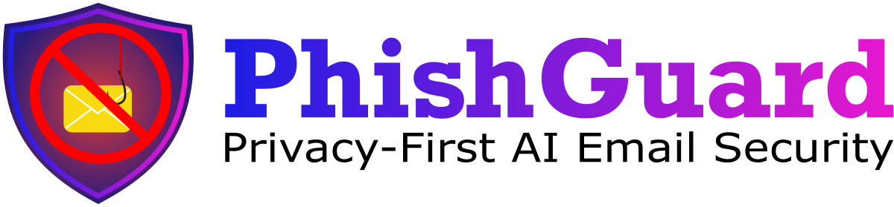
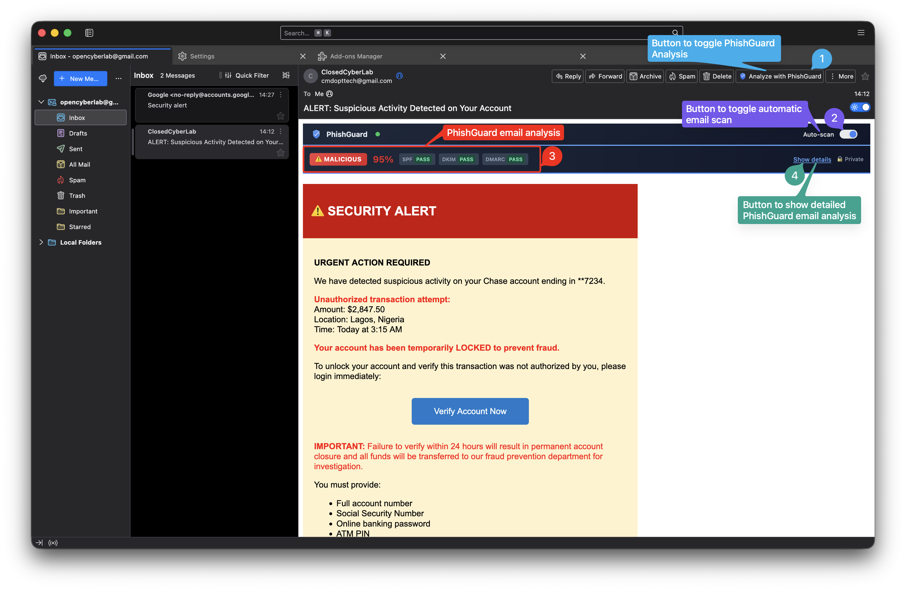
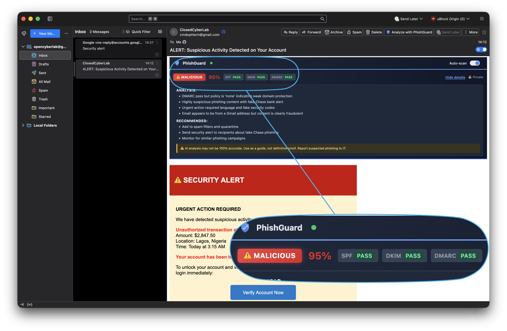
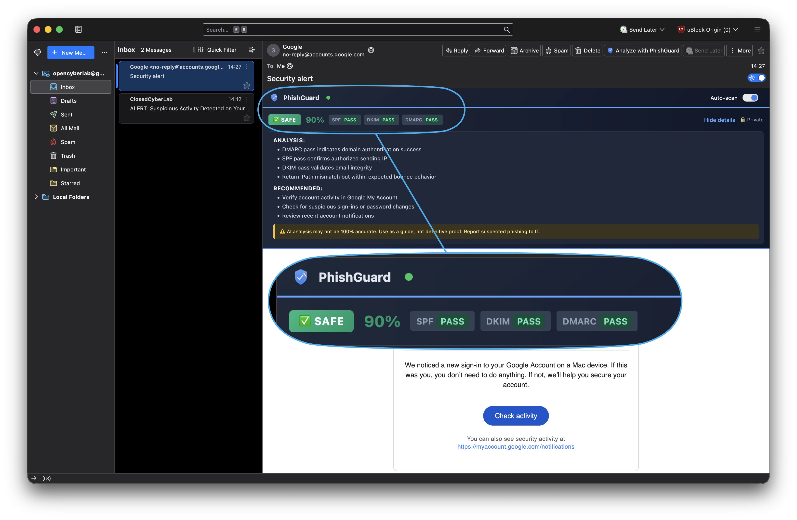
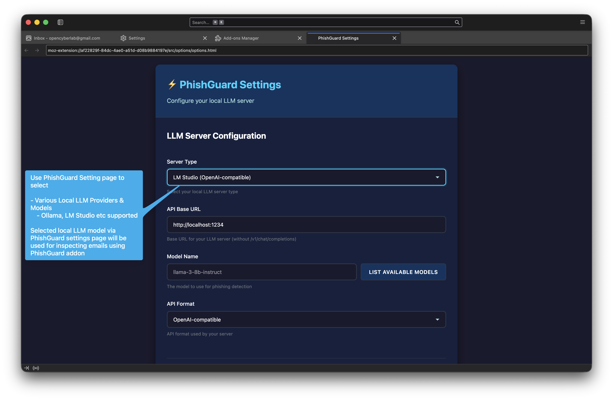

<div align="center">
  
  
  <p><strong>AI-powered email phishing detection using a private, local LLM.</strong></p>
  <p><strong>No data leaves your device.</strong></p>
  
  <p>
    <a href="https://addons.thunderbird.net/en-US/thunderbird/addon/phishguard/"></a>
  </p>
  
  <p>
    <a href="https://github.com/OpenCyberLab/PhishGuard"></a>
    <a href="https://github.com/OpenCyberLab/PhishGuard/blob/main/LICENSE"></a>
    <a href="https://github.com/OpenCyberLab/PhishGuard/stargazers"></a>
  </p>
</div>

---

## Install

**The easiest way to install PhishGuard is from the official Thunderbird Add-ons site:**

**[Download PhishGuard from Thunderbird Add-ons](https://addons.thunderbird.net/en-US/thunderbird/addon/phishguard/)**

---

## Screenshots

### Usage Overview
<p align="center">
  
</p>

### Phishing Email Detection
<p align="center">
  
</p>

### Legitimate Email Analysis
<p align="center">
  
</p>

### Settings Page
<p align="center">
  
</p>

---

## Features

- Analyzes emails for phishing indicators using a local LLM
- 100% private - all analysis happens on your machine
- Clear verdict (Legitimate/Malicious) with confidence score
- Detailed analysis reasons and recommended actions
- Email authentication analysis (SPF, DKIM, DMARC)
- Auto-scan capability when opening emails
- Dark mode support
- **Multi-LLM Support** - Works with LM Studio, Ollama, llama.cpp, and more

## Quick Start

### 1. Install a Local LLM Server

Choose one of the following:

**LM Studio** (Easiest - GUI-based)
- Download from: https://lmstudio.ai/
- Install and load a model (recommended: Llama 3 8B, Mistral 7B)
- Start the local server (default port: 1234)

**Ollama** (Lightweight - Terminal-based)
```bash
# macOS/Linux
curl -fsSL https://ollama.com/install.sh | sh
ollama serve
ollama pull llama3:8b
```

**Docker** (All-in-one)
```bash
docker run -d -p 11434:11434 --name ollama ollama/ollama
docker exec ollama ollama pull llama3:8b
```

### 2. Install the Thunderbird Extension

**Option A: From Thunderbird Add-ons (Recommended)**

[Download PhishGuard from Thunderbird Add-ons](https://addons.thunderbird.net/en-US/thunderbird/addon/phishguard/)

**Option B: Manual Installation**

1. Download the latest `.xpi` file from [Releases](https://github.com/OpenCyberLab/PhishGuard/releases)
2. Open Thunderbird
3. Go to **Tools** > **Add-ons and Themes**
4. Click the gear icon > **Install Add-on From File...**
5. Select the downloaded `.xpi` file

### 3. Configure PhishGuard

1. Go to **Tools** > **Add-ons and Themes**
2. Find PhishGuard and click **Options**
3. Select your server type (LM Studio, Ollama, etc.)
4. Test your connection
5. Save settings

## Usage

1. **Start your local LLM server** (LM Studio, Ollama, etc.)
2. **Open any email** in Thunderbird
3. **View the analysis** - PhishGuard automatically scans emails and shows:
   - **Verdict**: Legitimate or Malicious
   - **Confidence**: 0-100%
   - **Authentication**: SPF, DKIM, DMARC status
   - **Analysis**: Reasons for the verdict
   - **Actions**: Recommended next steps

## Supported LLM Servers

| Server | Default Port | API Format | Installation |
|--------|-------------|------------|--------------|
| **LM Studio** | 1234 | OpenAI-compatible | https://lmstudio.ai/ |
| **Ollama** | 11434 | Ollama API | https://ollama.com/ |
| **llama.cpp** | 8080 | OpenAI-compatible | Build from source |
| **LocalAI** | 8080 | OpenAI-compatible | Docker/Binary |
| **vLLM** | 8000 | OpenAI-compatible | pip install vllm |

## How It Works

1. When you open an email, PhishGuard extracts the content (subject, sender, body, headers)
2. Email authentication headers (SPF, DKIM, DMARC) are parsed and analyzed
3. The content is sent to your **local** LLM via the API
4. The LLM analyzes the email for phishing indicators
5. Results are displayed inline in the email view

## Privacy

- **All analysis happens locally** on your machine
- No email content is sent to external servers
- No tracking or telemetry
- Your emails stay private

## Recommended Models

**For Best Accuracy:**
- Llama 3 8B or 70B
- Mistral 7B-Instruct
- Qwen 2.5 7B

**For Faster Performance:**
- Phi-3 Mini (3.8B)
- TinyLlama (1.1B)

**Requirements:**
- Model must support JSON output
- Recommended: 8GB+ RAM for 7-8B models
- Minimum: 4GB RAM for smaller models

## Troubleshooting

**"Cannot connect to LLM server"**
- Ensure your LLM server is running
- Verify the correct port in PhishGuard Options
- Click "Open Settings" in the error panel to configure

**"No models found"**
- LM Studio: Load a model in the GUI first
- Ollama: Run `ollama pull llama3:8b` to download a model

**"LLM response does not match expected schema"**
- Try a larger/more capable model
- Smaller models (< 3B parameters) may struggle with JSON output

**Extension not appearing**
- Make sure you're using Thunderbird 115.0 or higher
- Try reloading the extension

## Development

### Building from Source

```bash
# Clone the repository
git clone https://github.com/OpenCyberLab/PhishGuard.git
cd PhishGuard

# Install dependencies
npm install

# Build the extension (.xpi file)
npm run build

# The built extension will be in the web-ext-artifacts/ folder
```

### Loading for Development

1. Open Thunderbird
2. Go to **Tools** > **Add-ons and Themes**
3. Click the gear icon > **Debug Add-ons**
4. Click **Load Temporary Add-on**
5. Select `manifest.json` from this directory

## Project Structure

```
PhishGuard/
├── src/
│   ├── background/       # Background scripts
│   │   └── background.js
│   ├── shared/           # Shared modules
│   │   ├── api.js        # Multi-LLM API client
│   │   ├── config-manager.js
│   │   ├── parsing.js    # Email parsing
│   │   └── state.js      # State validation
│   ├── options/          # Extension options page
│   │   ├── options.html
│   │   ├── options.js
│   │   └── options.css
│   └── messageDisplay/   # Inline panel UI
│       ├── inject.js
│       └── inject.css
├── icons/                # Extension icons
├── Images/               # Screenshots and documentation images
├── manifest.json         # Extension manifest
└── package.json          # Build configuration
```

## License

MIT License - See [LICENSE](LICENSE) file for details.

## Contributing

Contributions are welcome! Please feel free to submit a Pull Request.

## Links

- [Download from Thunderbird Add-ons](https://addons.thunderbird.net/en-US/thunderbird/addon/phishguard/)
- [Report Issues](https://github.com/OpenCyberLab/PhishGuard/issues)
- [OpenCyberLab](https://github.com/OpenCyberLab)
